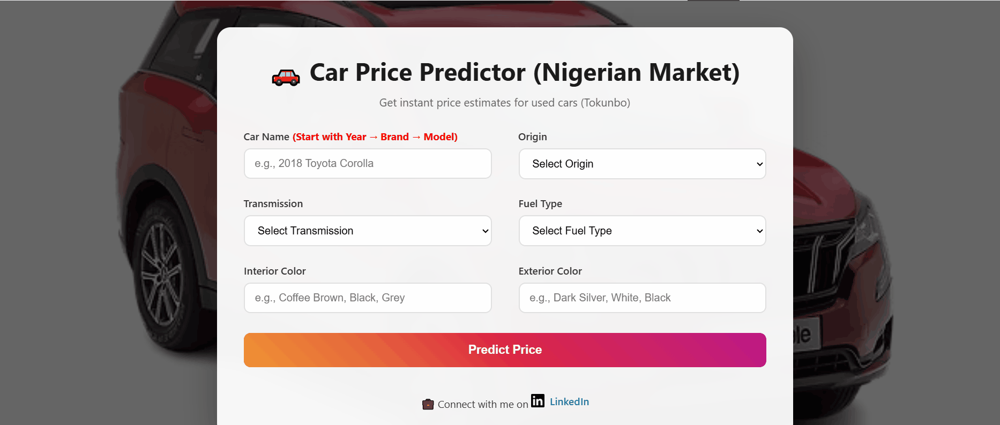
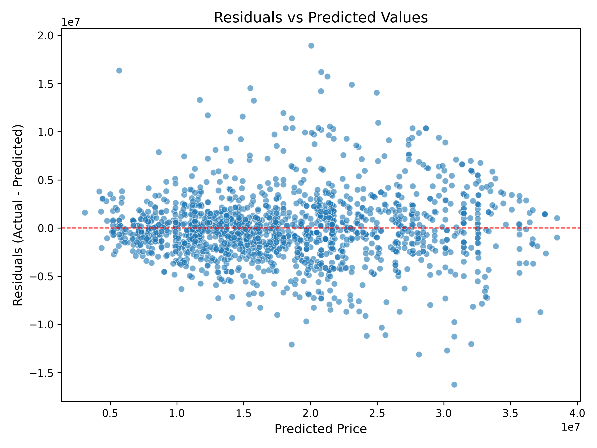
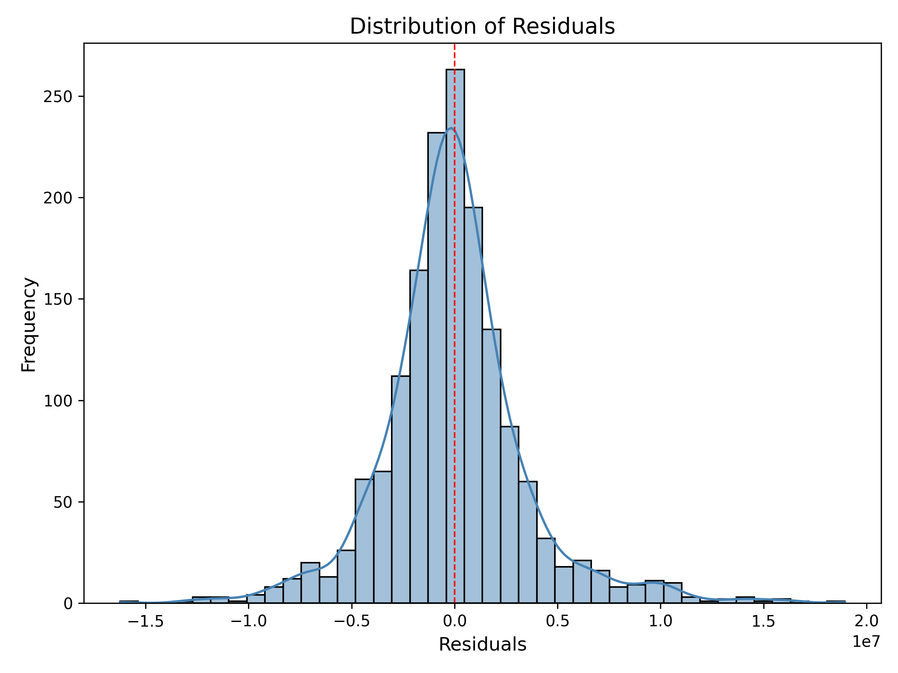
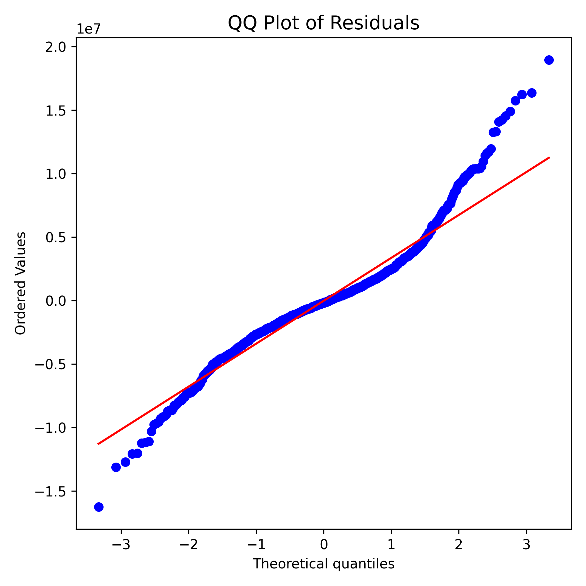

# Used Car Price Prediction for Nigerian Market

A machine learning web application that predicts used car prices in Nigeria using semantic embeddings and LightGBM regression. The model was trained on 9,835 scraped car listings from Autochek Nigeria and achieves 83% accuracy (R² score).

**Live Demo:** [https://huggingface.co/spaces/adeyemi001/Cars](https://huggingface.co/spaces/adeyemi001/Cars)



## Table of Contents

- [Overview](#overview)
- [Project Motivation](#project-motivation)
- [Dataset](#dataset)
- [Features](#features)
- [Methodology](#methodology)
- [Model Architecture](#model-architecture)
- [Model Performance](#model-performance)
- [Technology Stack](#technology-stack)
- [Project Structure](#project-structure)
- [Installation](#installation)
- [Usage](#usage)
- [Deployment](#deployment)
- [Key Insights](#key-insights)
- [Future Improvements](#future-improvements)
- [License](#license)

## Overview

This project implements an end-to-end machine learning solution for predicting used car prices in the Nigerian automotive market. The system uses advanced natural language processing techniques (sentence embeddings) to capture semantic relationships between car names and their prices, combined with traditional categorical features.

## Project Motivation

Most Nigerians prefer second-hand cars due to:
- High cost of new vehicles driven by import duties
- Lower maintenance costs for used vehicles
- Better value proposition for budget-conscious buyers

This tool helps buyers and sellers make informed decisions by providing accurate price predictions based on market data.

## Dataset

- **Source:** Autochek Nigeria (https://autochek.africa/ng)
- **Size:** 9,835 car listings
- **Price Range:** Up to 40 million Naira
- **Original Features:**
  - Car name (brand, model, year)
  - Price
  - Origin (local/foreign)
  - Mileage
  - Engine type
  - Transmission
  - Fuel type
  - Interior color
  - Exterior color

## Features

The final model uses 12 carefully selected features:

**Semantic Features (10):**
- 10 embedding dimensions from car name encoding (capturing brand, model, and year semantics)
  - `name_emb_307`, `name_emb_741`, `name_emb_559`, `name_emb_618`
  - `name_emb_207`, `name_emb_661`, `name_emb_766`, `name_emb_541`, `name_emb_518`

**Categorical Features (3):**
- `origin_local`: Whether the car is locally sourced
- `interior_color_coffee brown`: Coffee brown interior indicator
- `exterior_color_dark silver`: Dark silver exterior indicator

Note: During feature engineering, mileage and engine type were removed as they showed minimal influence on price predictions.

## Methodology

### 1. Data Preprocessing

- Removed duplicate and redundant columns (rating, engine_badge)
- Capped prices at 40 million Naira based on market analysis
- Cleaned and standardized categorical variables

### 2. Feature Engineering

**Sentence Embeddings:**
Instead of manually extracting brand, model, and year as separate features, I used the `all-mpnet-base-v2` sentence transformer model to generate 768-dimensional embeddings from car names. This approach:
- Captures semantic relationships (e.g., Toyota Camry 2015 vs 2016)
- Generalizes better to unseen car models
- Preserves contextual information about brand prestige and model popularity

**One-Hot Encoding:**
Applied to categorical features (origin, transmission, fuel type, interior color, exterior color) with `drop_first=True` to prevent multicollinearity.

### 3. Feature Selection

Used stepwise selection to identify the 12 most influential features from 768+ embedding dimensions and categorical variables.

### 4. Model Training

Trained a LightGBM regression model optimized for the Nigerian used car market.

## Model Architecture

**Algorithm:** LightGBM Regressor

**Hyperparameters:**
```python
{
    "n_estimators": 300,
    "max_depth": 6,
    "learning_rate": 0.1,
    "objective": "regression",
    "random_state": 42
}
```

## Model Performance

| Metric | Value | Interpretation |
|--------|-------|----------------|
| RMSE | ₦3,481,221.84 | Average prediction error |
| MAPE | 15.56% | Mean absolute percentage error |
| R² Score | 0.8304 | Model explains 83% of price variance |

The model demonstrates strong predictive performance with a MAPE of 15.56%, meaning predictions are typically within ±16% of actual prices. Given the average car price of ₦18.1 million in the dataset, the RMSE of ₦3.48 million represents a reasonable error margin for the Nigerian used car market.

### Dataset Statistics

| Statistic | Price (₦) |
|-----------|-----------|
| Mean | 18,140,400 |
| Median | 16,500,000 |
| Std Dev | 8,460,545 |
| Min | 2,315,000 |
| Max | 40,000,000 |
| Sample Size | 8,022 cars |

### Model Diagnostics

**Residual Analysis:**

The model's residuals show healthy patterns indicating good predictive performance:

1. **Residuals vs Predicted Values:** Points are randomly scattered around zero with no clear patterns, indicating homoscedasticity (constant variance) and appropriate model specification.

2. **Distribution of Residuals:** The residuals follow an approximately normal distribution centered at zero, validating the assumptions of linear regression-based models.

3. **Q-Q Plot:** Residuals closely follow the theoretical normal distribution line, with slight deviations in the tails indicating a few outliers but overall good model fit.





## Technology Stack

**Machine Learning:**
- Python 3.x
- LightGBM
- scikit-learn
- sentence-transformers (all-mpnet-base-v2)
- NumPy, Pandas

**Web Application:**
- Flask/Gradio (based on your app.py)
- HTML/CSS/JavaScript

**Deployment:**
- Docker
- Hugging Face Spaces

**Development Tools:**
- Jupyter Notebook
- Git/GitHub

## Project Structure

```
.
├── app.py                          # Main web application
├── requirements.txt                # Python dependencies
├── Dockerfile                      # Docker configuration
├── docker-compose.yml              # Docker Compose setup
├── README.md                       # Project documentation
├── Getting the data.ipynb          # Data scraping notebook
├── cars45_scraped.csv              # Raw dataset
├── embeddings/
│   ├── car_name_embeddings.npy     # Precomputed embeddings
│   ├── car_names_list.txt          # List of car names
│   ├── categorical_features_map.pkl # Encoded categorical features
│   └── all_mpnet_base_v2/          # Sentence transformer model
├── model/
│   ├── lightgbm_used_car_model.pkl # Trained model
│   ├── model_parameters.json       # Model hyperparameters
│   └── model_metrics.json          # Performance metrics
├── static/
│   └── Car Images/                 # UI images
└── templates/
    └── index.html                  # Web interface
```

## Installation

### Local Setup

1. Clone the repository:
```bash
git clone https://github.com/yourusername/used-car-price-prediction.git
cd used-car-price-prediction
```

2. Create a virtual environment:
```bash
python -m venv venv
source venv/bin/activate  # On Windows: venv\Scripts\activate
```

3. Install dependencies:
```bash
pip install -r requirements.txt
```

4. Run the application:
```bash
python app.py
```

### Docker Setup

1. Build the Docker image:
```bash
docker-compose build
```

2. Run the container:
```bash
docker-compose up
```

The application will be available at `http://localhost:5000` (or your configured port).

## Usage

1. Navigate to the web interface
2. Enter car details:
   - Car name (e.g., "Toyota Camry 2015")
   - Origin (local/foreign)
   - Transmission type
   - Fuel type
   - Interior color
   - Exterior color
3. Click "Predict Price"
4. View the estimated price in Nigerian Naira

## Deployment

The application is deployed on Hugging Face Spaces using Docker for consistent environment management across platforms. The deployment includes:
- Pre-loaded sentence transformer model for fast inference
- Cached embeddings for common car models
- Optimized LightGBM model for quick predictions

## Key Insights

1. **Semantic embeddings outperform manual feature extraction** for car names, capturing subtle relationships between brands, models, and years.

2. **Mileage and engine type had minimal impact** on price predictions in the Nigerian market, likely due to:
   - Inconsistent reporting in listings
   - Buyer focus on brand and model over technical specifications

3. **Origin (local vs. foreign) is a significant predictor**, reflecting import duty costs and buyer preferences.

4. **Specific colors matter** - coffee brown interior and dark silver exterior showed statistical significance.

5. **Price cap at 40 million Naira** aligns with the second-hand car market segment, improving model accuracy for the target demographic.

## Future Improvements

- Expand dataset with more recent listings
- Implement real-time scraping for up-to-date predictions
- Add more granular location-based pricing (Lagos, Abuja, etc.)
- Integrate car condition ratings from inspection reports
- Build mobile application for on-the-go price checks
- Add price trend analysis and forecasting
- Implement user feedback loop to improve predictions

## License

This project is licensed under the MIT License - see the LICENSE file for details.

---


**Note:** This project is for educational and research purposes. Always consult with automotive experts and conduct thorough inspections before purchasing a vehicle.
